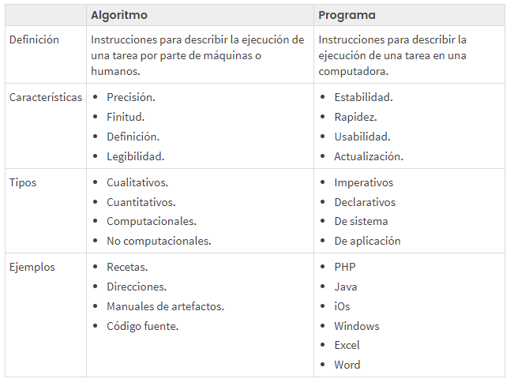

# Algoritmo Vs Programa 
    + Un algoritmo es un conjunto de instrucciones ordenadas,finitas y delimitadas que se crean con el fin de describir de forma sistematica la ejecucion de ua tarea.

   # Características de los algoritmos

    + Son precisos: las instrucciones tienen que ser concretas y no pueden dar lugar a ambigüedades.
    + Son finitos: no importa cuántos pasos tenga un proceso, este debe tener un inicio y un fin.
    + Tienen que estar definidos: los algoritmos siempre tienen que dar el mismo resultado, independientemente de las veces que se ejecuten.
    Describen tres elementos: entrada, proceso y salida.
    + Deben ser legibles: las instrucciones tienen que ser leídas con facilidad.

    + Un programa es una secuencia lógica de instrucciones para ejecutar tareas específicas en una computadora. Dicha secuencia están escritas en  código y son diseñadas por programadores, usando uno o más Algoritmos

   # Tipos de algoritmos
   
   + Algoritmos cualitativos: no requieren de cálculos numéricos para su ejecución. En su lugar, se deben ejecutar secuencias lógicas.
   + Algoritmos cuantitativos: requieren de cálculos numéricos, como la solución a una ecuación.
   + Algoritmos computacionales: requieren de operaciones numéricas que deben resolverse el uso de un dispositivo de cálculo, como una computadora o calculadora. Ecuaciones de mucha complejidad o códigos que solo pueden ser interpretados por una máquina, son ejemplos de este tipo de algoritmo.
   + Algoritmos no computacionales: no es necesario ejecutar una operación de cálculo, o en su defecto la secuencia puede o debe ser ejecutada por un ser humano. Ejemplos prácticos de algoritmos no computacionales son los cálculos numéricos sencillos, o las instrucciones para llegar a un lugar.
   
   # Características de un programa

   + Estabilidad: un programa debería ejecutar su tarea sin fallar, y si esto llegara a ocurrir, debería tener opciones de recuperación de los datos.
   + Rapidez: el programa debería ejecutarse en un tiempo razonable y sin interferir con otras instrucciones.
   + Usabilidad: un programa tiene que ser fácil de comprender y de utilizar por el usuario.
   + Actualización: todo programa debería mejorarse continuamente a nuevas versiones que se adapten a las necesidades del dispositivo y del usuario.
   Tipos de programas

  # Los programas pueden clasificarse en dos tipos: 
   según su tipo de lenguaje de programación y según sus funciones o tareas.

    + Programas según su tipo de lenguaje de programación
    En el ámbito de la programación existen dos paradigmas: imperativos y declarativos.

    * Programas de lenguaje imperativo: en este caso, las instrucciones se ejecutan siguiendo una secuencia. Este tipo de programas están descritos de tal forma que las condiciones o pasos a seguir permitan su modificación para poder ejecutar una tarea. Lenguajes como Java y PHP pertenecen a esta categoría.
    * Programas de lenguaje declarativo: los comandos están descritos en forma de declaraciones que, si bien permiten entender el problema a resolver, no asigna una secuencia de pasos para resolverlo. Y a diferencia de los programas imperativos, no pueden ser modificados. Scala y Elixir son dos tipos de programas declarativos.

    # Programas según sus funciones

    + Programas de sistema: son el conjunto de comandos necesarios para ejecutar todas las funciones de una computadora. Además, son los que permiten controlar o intercambiar datos con el hardware, o elementos físicos de la computadora. El sistema operativo Windows en un conjunto de programas de sistema.
    + Programas de aplicación: su función es ejecutar tareas específicas que faciliten el uso del dispositivo por parte del usuario. Pueden estar incluidas en el software de sistema o se pueden instalar por separado. Los procesadores de texto (como Word), las hojas de cálculo y el editor de imágenes son algunos programas de aplicación.
   
   # Diferencias 
   + La diferencia entre un algoritmo y un programa es que si bien ambos hacen referencia una serie de instrucciones, los algoritmos pueden estar escritos en código o en lenguaje natural, mientras que los programas sólo pueden estar escritos en lenguaje de programación.

    